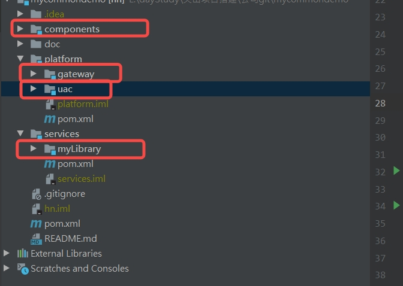
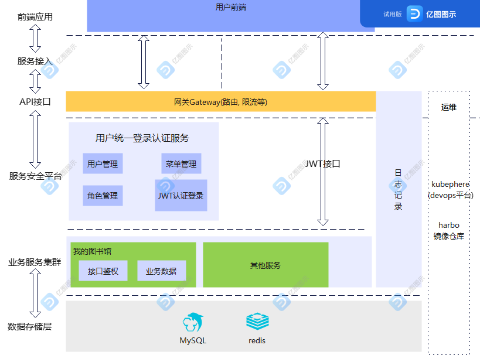

#系统说明

### 技术栈
#### 后端
**SpringBoot、SpringCloudGateway、SpringSecurity、JWT、Nacos、Redis、Mysql**
#### 前端
**Vue、Element-ui**

## 服务端项目结构

* maven多模块

| 模块名                | 说明                     |
|---------|-------------|
| `component`    | 通用依赖(springboot stater、实体类、工具类、配置类等等)        |
| `platform`  | 数据安全平台(Gateway网关、统一认证中心UAC)       |
| `services` | 业务微服务(我的图书馆myLibrary) |

## 系统架构

## 权限设计

sys_user  用户表
sys_role  角色表
sys_menu  菜单表
sys_user_role  用户角色表: 用户角色一对多,ID关联
sys_role_menu  角色菜单表: 角色菜单一对多,ID关联

## 项目启动
### 后端
* 启动redis、mysql、nacos
* 运行sql文件  ./doc/sys-db.sql
* 运行com.sys.login.UacApplication
* 运行com.sys.library.UacApplication
* 运行com.sys.library.MyLibraryApplication

### 前端
* npm install
* npm run serve

### 系统已有账号

| 账号                | 密码                     |            手机号   |权限说明|
|--------------------|------------------------|-------------|------------|
| test001   |000        |18308996929|CRUD超级权限|
| test002  | 000      |15071269320|R权限|
| test003 | 000 |15071269321|R权限|

### 接口说明
* 账号密码登录接口  
  http://localhost:30000/uac/user/login  
* 短信验证码登录接口  
  http://localhost:30000/uac/user/sms/login  
* 我的图书馆CRUD接口  
  http://localhost:30000/myLibrary/myLibrary/list  
  http://localhost:30000/myLibrary/myLibrary/add  
  http://localhost:30000/myLibrary/myLibrary/delete  
  http://localhost:30000/myLibrary/myLibrary/edite  

* swagger接口  
  http://localhost:30000/uac/doc.html  
  http://localhost:30000/myLibrary/doc.html  

